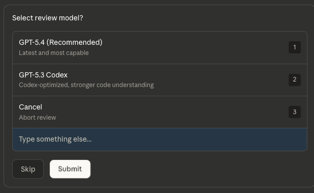
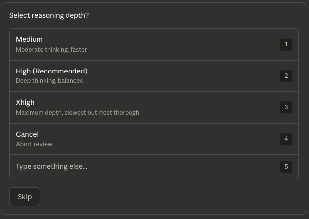
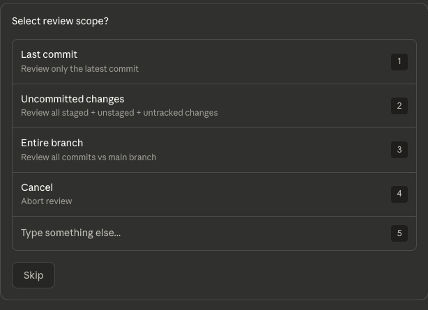
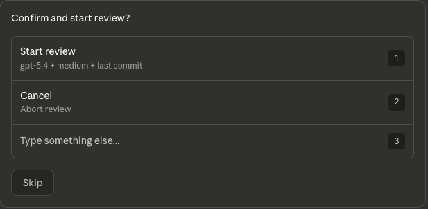

# Codex Review Skill for Claude Code

**[中文说明](./README_CN.md)** | **English**

> Turn OpenAI Codex CLI code reviews into a guided, no-command-line-needed experience inside Claude Code.

## What It Does

Instead of memorizing `codex review -c 'model="gpt-5.4"' -c 'model_reasoning_effort="high"' --uncommitted`, you just type `/codexskill` and pick from menus:

**Step 1** — Pick model | **Step 2** — Pick depth | **Step 3** — Pick scope | **Step 4** — Confirm






Review runs in background. You get notified when it's done.

## Features

- **No commands to remember** — interactive menus guide you through every option
- **Cancel anytime** — every step has a cancel button
- **Shortcut mode** — power users can skip menus: `/codexskill 54h uc`
- **Background execution** — review runs async, doesn't block your workflow
- **All models supported** — GPT-5.4, 5.3-codex, 5.2-codex, 5.1-codex-max
- **Three reasoning depths** — Medium (fast), High (balanced), Xhigh (thorough)

## Prerequisites

1. [Claude Code](https://claude.ai/code)
2. OpenAI API Key or OAuth authorization (requires an active OpenAI account)
3. [OpenAI Codex CLI](https://github.com/openai/codex) installed and authenticated:
   ```bash
   npm install -g @openai/codex
   ```

### Authentication

Choose one method:

```bash
# Method 1: Browser login (recommended)
codex login

# Method 2: API key via environment variable
export OPENAI_API_KEY="sk-..."

# Method 3: API key via stdin
echo "sk-..." | codex login --with-api-key
```

Verify auth status:
```bash
codex login status
```

## Installation

### English version (default)

```bash
mkdir -p ~/.claude/skills/codexskill
curl -o ~/.claude/skills/codexskill/SKILL.md \
  https://raw.githubusercontent.com/heishiqing/codex-review-skill/main/en/SKILL.md
```

### Chinese version (中文版)

```bash
mkdir -p ~/.claude/skills/codexskill
curl -o ~/.claude/skills/codexskill/SKILL.md \
  https://raw.githubusercontent.com/heishiqing/codex-review-skill/main/zh/SKILL.md
```

## Usage

### Interactive Mode

Type `/codexskill` in Claude Code. Follow the 4-step wizard.

### Shortcut Mode

Skip the wizard by passing model code + scope directly:

```
/codexskill 54h uc       # GPT-5.4 High + uncommitted changes
/codexskill 53x head     # GPT-5.3 Codex Xhigh + last commit
/codexskill uc            # Default (GPT-5.4 High) + uncommitted
```

### Model Codes Quick Reference

| Code | Model | Reasoning |
|------|-------|-----------|
| `54m` `54h` `54x` | gpt-5.4 | medium / high / xhigh |
| `53m` `53h` `53x` | gpt-5.3-codex | medium / high / xhigh |
| `52m` `52h` `52x` | gpt-5.2-codex | medium / high / xhigh |
| `51m` `51h` `51x` | gpt-5.1-codex-max | medium / high / xhigh |

## How It Works

This skill teaches Claude Code how to:
1. Present interactive selection menus via `AskUserQuestion`
2. Map your choices to the correct `codex review -c` parameters
3. Run the review command in background
4. Notify you when it completes

The actual review is performed by OpenAI Codex CLI — this skill is just the UI layer.

## License

MIT
