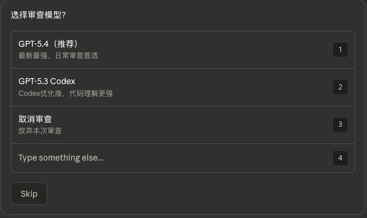
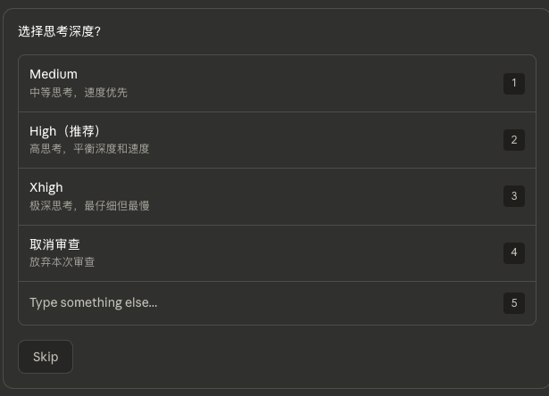
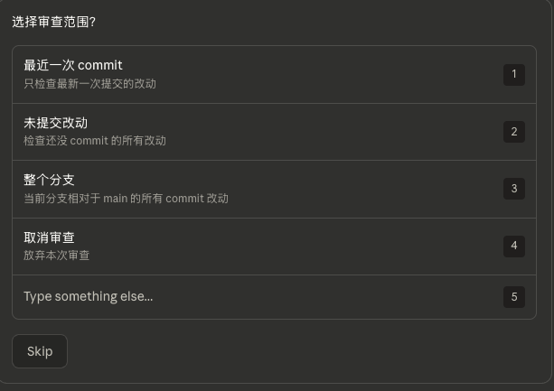
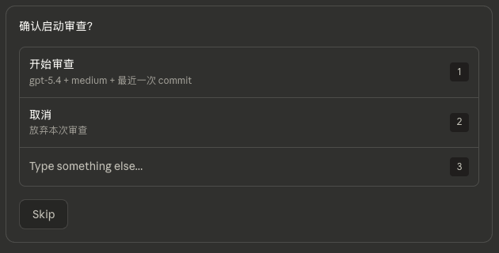

# Codex Review Skill for Claude Code

**中文** | **[English](./README.md)**

> 把 OpenAI Codex CLI 的代码审查变成无需记命令的交互式体验。

## 它做什么

不用再记 `codex review -c 'model="gpt-5.4"' -c 'model_reasoning_effort="high"' --uncommitted` 这种长命令。只需输入 `/codexskill`，然后从菜单选：

**第 1 步** — 选模型 | **第 2 步** — 选深度 | **第 3 步** — 选范围 | **第 4 步** — 确认






审查在后台运行，完成后自动通知。

## 功能特点

- **不需要记命令** — 交互菜单引导你完成每一步
- **随时取消** — 每一步都有取消按钮
- **快捷模式** — 老手可以跳过菜单：`/codexskill 54h uc`
- **后台执行** — 审查异步运行，不阻塞工作流
- **支持所有模型** — GPT-5.4、5.3-codex、5.2-codex、5.1-codex-max
- **三种思考深度** — Medium（快速）、High（平衡）、Xhigh（最仔细）

## 前置条件

1. [Claude Code](https://claude.ai/code) 已安装
2. OpenAI API Key 或 OAuth 授权（需要有效的 OpenAI 账号）
3. [OpenAI Codex CLI](https://github.com/openai/codex) 已安装并授权：
   ```bash
   npm install -g @openai/codex
   ```

### 授权配置

三选一：

```bash
# 方法 1: 浏览器登录（推荐，走 OAuth）
codex login

# 方法 2: API Key 环境变量
export OPENAI_API_KEY="sk-..."

# 方法 3: API Key 管道输入
echo "sk-..." | codex login --with-api-key
```

验证授权状态：
```bash
codex login status
```

## 安装

### 让 Claude 帮你安装

在 Claude Code 中发送：

> 帮我安装 codexskill：下载 https://raw.githubusercontent.com/heishiqing/codex-review-skill/main/zh/SKILL.md 保存到 ~/.claude/skills/codexskill/SKILL.md

### 手动安装

#### 中文版（推荐）

```bash
mkdir -p ~/.claude/skills/codexskill
curl -o ~/.claude/skills/codexskill/SKILL.md \
  https://raw.githubusercontent.com/heishiqing/codex-review-skill/main/zh/SKILL.md
```

### English version

```bash
mkdir -p ~/.claude/skills/codexskill
curl -o ~/.claude/skills/codexskill/SKILL.md \
  https://raw.githubusercontent.com/heishiqing/codex-review-skill/main/en/SKILL.md
```

## 使用方法

### 交互模式

在 Claude Code 中输入 `/codexskill`，按 4 步向导操作。

### 快捷模式

跳过向导，直接传入模型代号 + 范围：

```
/codexskill 54h uc       # GPT-5.4 High + 未提交改动
/codexskill 53x head     # GPT-5.3 Codex Xhigh + 最近一次提交
/codexskill uc            # 默认 (GPT-5.4 High) + 未提交改动
```

### 模型代号速查

| 代号 | 模型 | 思考深度 |
|------|------|----------|
| `54m` `54h` `54x` | gpt-5.4 | 中 / 高 / 极深 |
| `53m` `53h` `53x` | gpt-5.3-codex | 中 / 高 / 极深 |
| `52m` `52h` `52x` | gpt-5.2-codex | 中 / 高 / 极深 |
| `51m` `51h` `51x` | gpt-5.1-codex-max | 中 / 高 / 极深 |

## 工作原理

这个 Skill 教会 Claude Code 如何：
1. 通过 `AskUserQuestion` 展示交互选择菜单
2. 将你的选择映射到正确的 `codex review -c` 参数
3. 在后台运行审查命令
4. 完成后通知你

实际审查由 OpenAI Codex CLI 执行 — 这个 Skill 只是 UI 层。

## License

MIT
